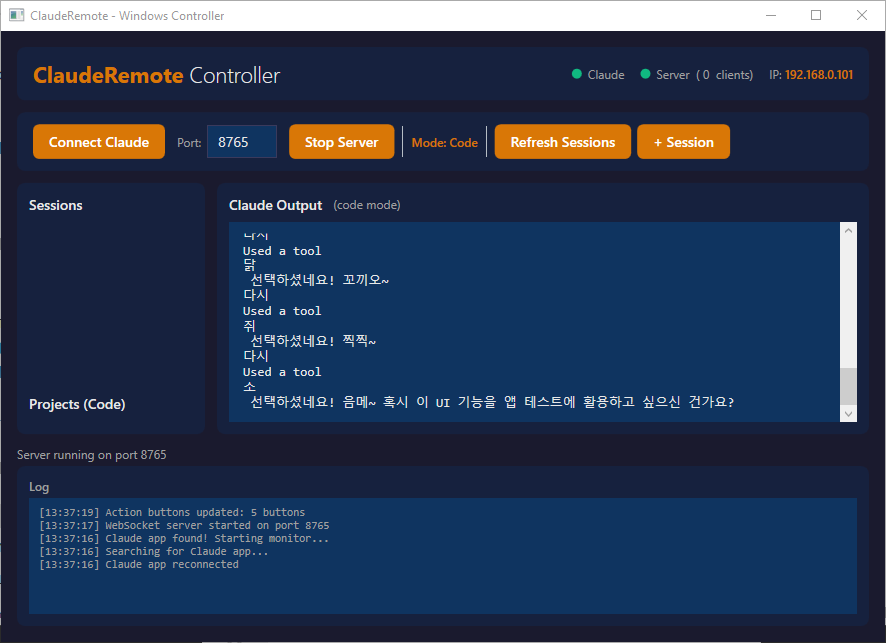
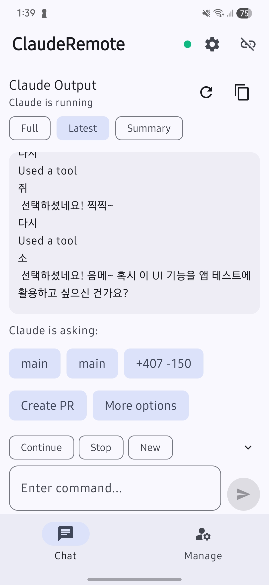
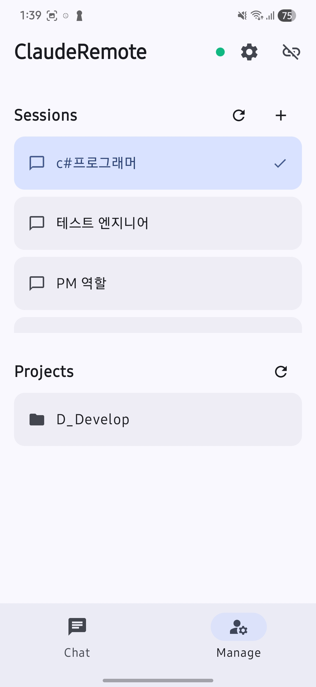
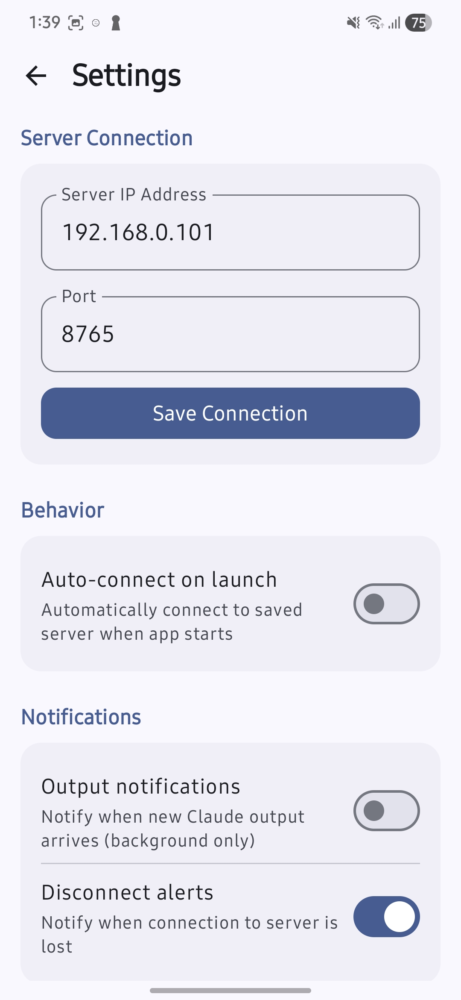

# ClaudeRemote

Windows PC의 **Claude Code** 데스크톱 앱을 Android 스마트폰에서 원격으로 모니터링하고 제어하는 시스템입니다.

> **현재 Claude Code (Code 모드) 전용입니다.** Claude Chat / Cowork 모드는 지원하지 않습니다.

> ⚠️ **Claude 앱 버전 호환성**
> **2026-04-15** 이전에 작성된 커밋은 Claude Code 앱 **`1.2581.0 (f10398)` 미만 버전에서만** 동작합니다.
> `1.2581.0 (f10398)` 버전부터는 Claude 앱 UI가 크게 변경되어 UIAutomation 매핑을 다시 작업해야 합니다. 사용 중인 Claude 앱 버전에 맞는 커밋을 사용하세요.

## 개요

ClaudeRemote는 두 개의 앱으로 구성됩니다:

- **Windows 서버** (C# WPF) — Claude Code 앱을 UIAutomation으로 제어하고, WebSocket 서버로 Android와 통신
- **Android 클라이언트** (Kotlin Compose) — 원격에서 Claude 출력 확인, 명령 입력, 세션/프로젝트 관리

같은 네트워크(Wi-Fi)에서 동작하며, Claude Code가 작업 중일 때 자리를 비워도 스마트폰으로 진행 상황을 확인하고 명령을 내릴 수 있습니다.

## 다운로드

빌드된 실행 파일은 [`Asset/`](Asset/) 폴더에서 받을 수 있습니다.

| 파일 | 플랫폼 | 크기 | 요구사항 |
|------|--------|------|----------|
| [ClaudeCodeRemote-1.0-Windows-x64.zip](Asset/ClaudeCodeRemote-1.0-Windows-x64.zip) | Windows x64 | 약 3.0 MB | Windows 10/11 (x64), .NET 8 Desktop Runtime, Claude Code 데스크톱 앱 |
| [ClaudeCodeRemote-1.0-android.apk](Asset/ClaudeCodeRemote-1.0-android.apk) | Android | 약 16.3 MB | Android 8.0 (API 26) 이상 |

**Windows 설치:**
1. ZIP 파일을 다운로드하여 압축 해제
2. [.NET 8 Desktop Runtime](https://dotnet.microsoft.com/download/dotnet/8.0)이 설치되어 있지 않다면 설치
3. `ClaudeRemote.Windows.exe` 실행

**Android 설치:**
1. APK 파일을 Android 기기로 다운로드
2. 설정 → 보안에서 "출처를 알 수 없는 앱 설치" 허용
3. APK 파일을 열어 설치

## Screenshots
### Server



### Android

<p align="left">
  
  
  
</p>

## 주요 기능

| 기능 | 설명 |
|------|------|
| Claude 출력 모니터링 | 전체/최신/요약 3가지 모드로 출력 확인 |
| 원격 명령 입력 | Android에서 텍스트 입력 → Claude Code에 전달 |
| 선택 버튼 제어 | Claude가 제시하는 선택지를 Android에서 탭하여 선택 |
| 세션 관리 | 세션 목록 조회, 세션 전환, 새 세션 생성 |
| 프로젝트 관리 | 프로젝트 목록 조회, 프로젝트 전환 |
| 실시간 상태 감지 | Claude 앱 실행/종료 자동 감지, 스트리밍 상태 표시 |
| 자동 재연결 | 네트워크 끊김 시 지수 백오프로 자동 재연결 |
| 백그라운드 유지 | Android Foreground Service로 앱이 백그라운드여도 연결 유지 |
| 알림 | 새 출력 수신, 연결 끊김 시 알림 |
| Quick Commands | Continue, Stop, New Chat 빠른 명령 버튼 |
| 명령 히스토리 | 최근 10개 명령 기록 및 재사용 |
| 마크다운 렌더링 | 코드 블록, 볼드, 이탤릭, 헤딩, 리스트 기본 렌더링 |
| 테마 | 시스템/다크/라이트 테마 선택 |

---

## 기술 사양

### Windows 서버

| 항목 | 버전 |
|------|------|
| 프레임워크 | .NET 8.0 (net8.0-windows) |
| UI | WPF (Windows Presentation Foundation) |
| 언어 | C# 12 |
| IDE | Visual Studio 2022 (v17.8+) |
| 아키텍처 | MVVM |

#### NuGet 패키지

| 패키지 | 버전 | 용도 |
|--------|------|------|
| CommunityToolkit.Mvvm | 8.2.2 | MVVM 헬퍼 |
| Fleck | 1.2.0 | WebSocket 서버 |
| Microsoft.Extensions.DependencyInjection | 8.0.1 | DI 컨테이너 |
| Serilog | 3.1.1 | 로깅 |
| Serilog.Sinks.File | 5.0.0 | 파일 로깅 |
| Serilog.Sinks.Console | 5.0.1 | 콘솔 로깅 |

### Android 클라이언트

| 항목 | 버전 |
|------|------|
| 언어 | Kotlin 1.9.22 |
| UI | Jetpack Compose (BOM 2024.02.00) |
| 디자인 | Material Design 3 |
| compileSdk | 34 (Android 14) |
| minSdk | 26 (Android 8.0) |
| targetSdk | 34 |
| JVM Target | 17 |
| IDE | Android Studio (최신 안정판) |

#### 주요 라이브러리

| 라이브러리 | 버전 | 용도 |
|-----------|------|------|
| Compose Material3 | BOM 2024.02.00 | UI 컴포넌트 |
| Navigation Compose | 2.7.7 | 화면 네비게이션 |
| Lifecycle ViewModel | 2.7.0 | ViewModel |
| OkHttp | 4.12.0 | WebSocket 클라이언트 |
| kotlinx-serialization-json | 1.6.3 | JSON 직렬화 |
| kotlinx-coroutines-android | 1.8.0 | 비동기 처리 |
| DataStore Preferences | 1.0.0 | 설정 저장 |

### 통신

| 항목 | 사양 |
|------|------|
| 프로토콜 | WebSocket (ws://) |
| 메시지 형식 | JSON (UTF-8) |
| 기본 포트 | 8765 |
| 하트비트 | 30초 간격 |
| 대용량 메시지 | 10KB 초과 시 8KB 청크 분할 전송 |
| 프로토콜 버전 | v1.2 |

---

## 시작하기

### 사전 요구사항

- Windows PC에 **Claude Code 데스크톱 앱**이 설치되어 있어야 합니다
- Windows PC와 Android 기기가 **같은 Wi-Fi 네트워크**에 연결되어 있어야 합니다
- .NET 8 SDK (Windows 빌드용)
- Android Studio (Android 빌드용)

### 1. Windows 서버 빌드 및 실행

```bash
# 솔루션 경로로 이동
cd ClaudeRemote.Windows

# NuGet 패키지 복원 및 빌드
dotnet restore
dotnet build

# 실행
dotnet run --project ClaudeRemote.Windows
```

또는 Visual Studio 2022에서 `ClaudeRemote.Windows.sln`을 열고 F5로 실행합니다.

### 2. Android 앱 빌드 및 설치

Android Studio에서 `ClaudeRemote.Android/` 폴더를 열고, 실기기 또는 에뮬레이터에 빌드/설치합니다.

### 3. 연결

1. **Windows**: ClaudeRemote 실행 → "Connect Claude" 클릭 → Claude Code 앱 자동 감지
2. **Windows**: "Start Server" 클릭 → 헤더에 표시되는 **IP 주소** 확인
3. **Android**: ClaudeRemote 앱 실행 → Windows에 표시된 IP 주소와 포트(8765) 입력 → "Connect" 탭

---

## 사용 방법

### Windows 앱

Windows 앱은 Claude Code 앱과 Android 앱 사이의 **중계 서버** 역할을 합니다.

| 영역 | 설명 |
|------|------|
| 헤더 | Claude 연결 상태(초록/빨강), 서버 상태, 연결된 클라이언트 수, 로컬 IP 표시 |
| Controls | Claude 연결, 서버 시작/중지, 세션 관리 버튼 |
| 사이드바 | 세션 목록, 프로젝트 목록 |
| 메인 영역 | Claude 출력 내용 실시간 표시 |
| 로그 | 통신 로그, 이벤트 기록 |

#### 주요 동작

1. **Connect Claude** — Claude Code 앱 프로세스를 자동 탐지하여 연결. 연결 후 자동으로 Code 모드로 전환됩니다.
2. **Start Server** — WebSocket 서버를 시작합니다. 기본 포트는 8765이며 변경 가능합니다.
3. **Claude 앱 종료/재시작** — 자동으로 감지하여 재연결합니다 (5초 간격 모니터링).

### Android 앱

Android 앱은 원격에서 Claude Code를 조작하는 **리모컨** 역할을 합니다.

#### 화면 구성

**Chat 화면** (메인)
- 상단: Claude 출력 뷰어 (Full/Latest/Summary 전환)
- 중단: 마크다운 렌더링된 출력 내용
- 하단: Quick Commands (Continue, Stop, New) + 명령 입력 필드

**Manage 화면**
- 세션 목록: 조회, 선택, 새 세션 추가
- 프로젝트 목록: 조회, 프로젝트 전환

#### 주요 동작

1. **출력 확인** — Full(전체), Latest(최신 응답), Summary(요약) 모드로 Claude 출력 확인
2. **명령 입력** — 하단 입력 필드에 텍스트 입력 후 Send 버튼으로 전송
3. **Quick Commands** — Continue(계속), Stop(중지), New(새 세션) 빠른 실행
4. **선택 버튼** — Claude가 선택지를 제시하면 "Claude is asking:" 영역에 버튼 표시 → 탭하여 선택
5. **세션 전환** — Manage 탭에서 세션 목록 확인 및 전환
6. **프로젝트 전환** — Manage 탭에서 프로젝트 목록 확인 및 전환
7. **설정** — 상단 설정 아이콘 → 서버 주소 저장, 자동 연결, 알림, 테마 설정

#### 연결 설정

| 설정 | 설명 |
|------|------|
| Server IP | Windows PC의 로컬 IP (Windows 앱 헤더에 표시됨) |
| Port | WebSocket 포트 (기본 8765) |
| Auto-connect | 앱 시작 시 저장된 주소로 자동 연결 |
| 에뮬레이터 | `10.0.2.2`로 호스트 PC 접근 가능 |

---

## 프로젝트 구조

```
ClaudeRemote/
├── README.md
├── docs/
│   ├── PM.md                    # PM 역할 규칙
│   ├── PM_Phases.md             # Phase 관리 문서
│   ├── WindowsProgrammer.md     # Windows 개발 규칙
│   ├── AndroidProgrammer.md     # Android 개발 규칙
│   ├── Windows_Tasks.md         # Windows 작업 지시서
│   ├── Android_Tasks.md         # Android 작업 지시서
│   ├── ClaudeUI_Map.md          # Claude 앱 UI 트리 분석
│   └── reports/                 # Phase별 작업 보고서
│
├── protocol/
│   └── MessageProtocol.md       # WebSocket JSON 프로토콜 v1.2
│
├── ClaudeRemote.Windows/        # Windows WPF 솔루션
│   ├── ClaudeRemote.Windows.sln
│   └── ClaudeRemote.Windows/
│       ├── Models/              # 데이터 모델
│       ├── Services/            # UIAutomation, WebSocket, 세션 관리
│       ├── ViewModels/          # MVVM ViewModel
│       └── Views/               # WPF XAML UI
│
└── ClaudeRemote.Android/        # Android Compose 프로젝트
    └── app/src/main/java/com/clauderemote/
        ├── data/                # 모델, WebSocket 클라이언트, 설정
        ├── service/             # Foreground Service
        ├── ui/                  # Compose 화면, 테마
        └── viewmodel/           # ViewModel
```

---

## 제한사항

- **Claude Code 전용** — 현재 Claude Code (Code 모드)만 지원합니다. Claude Chat, Cowork 모드는 지원하지 않습니다.
- **같은 네트워크 필요** — Windows PC와 Android 기기가 동일한 로컬 네트워크에 있어야 합니다.
- **UIAutomation 의존** — Windows 앱은 Claude Code 앱의 UI 요소를 자동화하여 제어합니다. Claude 앱 업데이트로 UI 구조가 변경되면 동작이 불안정해질 수 있습니다.
- **클립보드 사용** — 텍스트 입력 시 시스템 클립보드를 사용합니다. 입력 중 클립보드 내용이 덮어써질 수 있습니다.
- **평문 통신** — WebSocket은 `ws://` (비암호화)를 사용합니다. 로컬 네트워크 외부에서는 사용하지 마세요.

---

## 라이선스

MIT License
